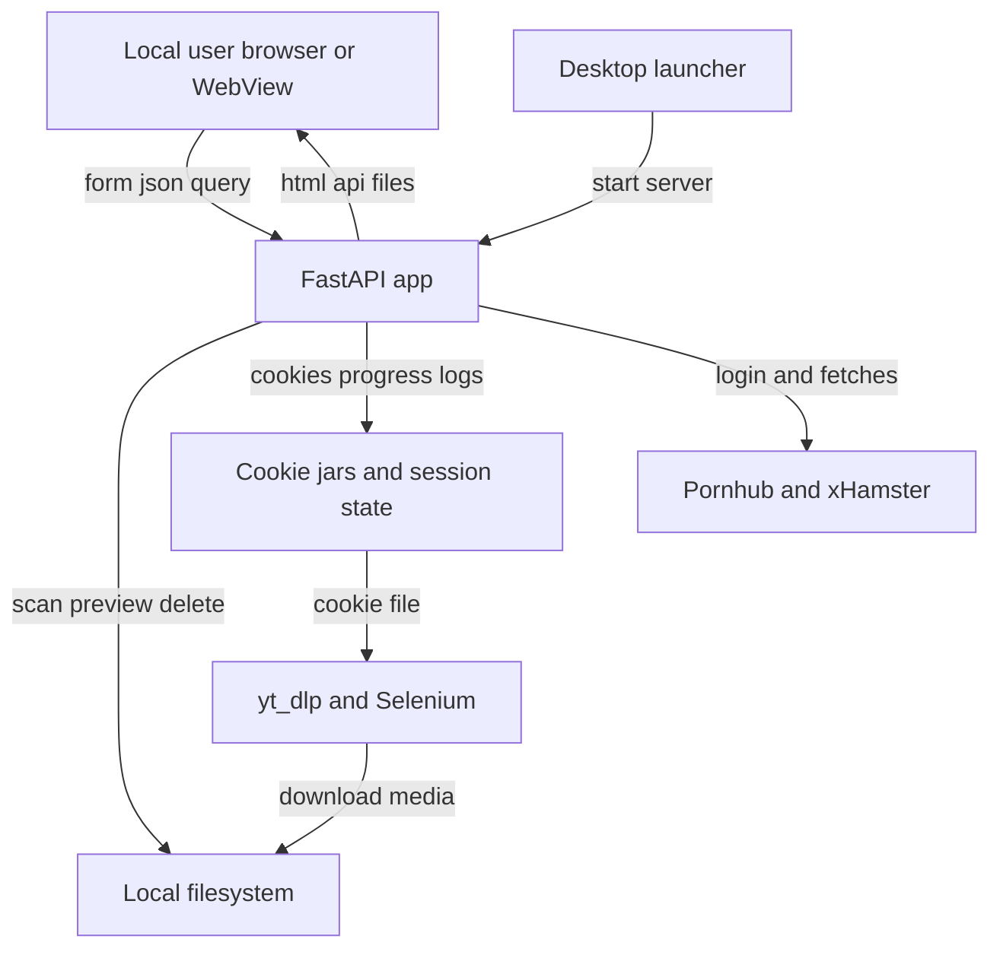

## Executive summary
SHUCK3R is primarily a desktop-style local FastAPI application with a browser/UI front end, local file operations, third-party site login flows, and background download automation. Under the stated assumptions of localhost-only use, no auth layer, and low data sensitivity, the highest risks are local cross-origin or same-user abuse of unauthenticated localhost routes, exposure of session artifacts such as cookie jars and logs, and destructive file operations that are intentionally broad outside protected system directories. The risk profile changes sharply if the app is started directly via `main.py`, because that path defaults to `0.0.0.0`, converting several local-only issues into network-reachable ones.

## Scope and assumptions
In-scope paths:
- `main.py`
- `duplicate_finder.py`
- `progress_tracker.py`
- `workflow_heuristics.py`
- `webview_login_bridge.py`
- `launcher.py`

Out-of-scope items:
- `archive/` scripts and legacy UI code
- tests and docs except where they clarify behavior
- dependency internals (`yt_dlp`, Selenium, pywebview)

Explicit assumptions:
- Intended deployment is desktop/local only on localhost.
- No authentication or authorization layer is expected in front of the web UI or API.
- Data sensitivity is low, but session cookies still have real security value.
- Single-user usage is the normal case; this is not designed as a multi-tenant service.
- Threats below are runtime-focused; build and CI concerns are separated and low priority here.

Open questions:
- Whether any packaging path ever runs the app by executing `main.py` directly rather than `launcher.py`.
- Whether browsers used with SHUCK3R may also browse untrusted sites while localhost routes are reachable.

## System model
### Primary components
- Local FastAPI server serving HTML, API routes, static assets, and file responses. Evidence: `app = FastAPI(...)` in `main.py`, route block at `main.py:1119+`.
- Desktop launcher that starts Uvicorn and opens pywebview or an external browser. Evidence: `DEFAULT_HOST = "127.0.0.1"` and `start_uvicorn_background(...)` in `launcher.py`.
- Download workflows for Pornhub and xHamster using Selenium/pywebview login plus `yt_dlp`. Evidence: `pornhub_workflow`, `xhamster_workflow`, cookie helpers, and `download_video_ytdlp` in `main.py`.
- Embedded login bridge that captures cookies from a pywebview window and writes a Netscape cookie jar to disk. Evidence: `begin_embedded_login`, `finish_embedded_login`, and `simplecookie_list_to_netscape_file` in `webview_login_bridge.py`.
- Duplicate finder with scan, preview, and delete endpoints over local files. Evidence: `resolve_scan_directory`, `resolve_deletable_file` in `duplicate_finder.py`; `/api/duplicates/*` routes in `main.py`.
- Progress/log subsystem storing session JSON and log files under the application log directory. Evidence: `ProgressTracker` in `progress_tracker.py`; `/download/log/*`, `/progress/*` routes in `main.py`.

### Data flows and trust boundaries
- User browser/WebView -> FastAPI server. Data types: form fields, JSON API bodies, query params, session IDs. Channel/protocol: HTTP on localhost or configured host/port. Security guarantees: none beyond network binding; no auth or CSRF defenses observed. Input validation: partial via Pydantic and helper validators.
- FastAPI server -> local filesystem. Data types: downloaded media paths, log paths, duplicate-scan directories, cookie jar files, progress JSON. Channel/protocol: local file I/O. Security guarantees: path validation for duplicate scan/delete and downloaded file serving; broader logging and cookie files rely on predictable app-controlled paths.
- FastAPI server -> third-party adult sites via Selenium, requests, pywebview, and `yt_dlp`. Data types: login pages, cookies, playlist/video URLs, media responses. Channel/protocol: HTTPS/browser automation and subprocess/library calls. Security guarantees: browser and TLS defaults; no origin pinning beyond hard-coded workflow URLs.
- pywebview login window -> cookie jar file -> `yt_dlp`/Selenium. Data types: authenticated session cookies. Channel/protocol: in-process cookie extraction and disk persistence. Security guarantees: no encryption at rest; deletion attempted during workflow cleanup.
- Background tasks -> progress/log endpoints. Data types: session IDs, log lines, progress JSON, workflow state. Channel/protocol: in-process memory plus local files exposed over HTTP. Security guarantees: no auth; access controlled only by knowledge of the session ID/path.

#### Diagram

## Assets and security objectives
| Asset | Why it matters | Security objective (C/I/A) |
| --- | --- | --- |
| Session cookies for third-party sites | Can grant account access or impersonate the user on source sites | C, I |
| Local downloaded media | User content selected for viewing and retention | C, I, A |
| Local non-system files reachable by duplicate routes | Delete/preview routes can touch files beyond the download folder | I, A, some C |
| Session logs and progress JSON | Reveal titles, paths, workflow state, and local activity | C |
| App availability during long-running downloads | Interrupted sessions waste time and may corrupt state | A |
| Workflow integrity | Wrong login state or forged progress actions can disrupt downloads | I, A |

## Attacker model
### Capabilities
- A malicious website running in the user’s browser that can send requests to localhost if the browser/network policy allows it.
- Another local user or process on the same machine able to connect to the configured host/port.
- A network-adjacent attacker if the app is started with a non-local bind address such as `0.0.0.0`.
- A user with knowledge of local file paths who can call the duplicate preview/delete APIs.

### Non-capabilities
- No assumed privilege escalation to OS admin/root.
- No assumed compromise of third-party sites themselves.
- No assumed arbitrary code execution inside the Python process before using app routes.
- No multi-tenant adversary model beyond the local machine or accidental network exposure.

## Entry points and attack surfaces
| Surface | How reached | Trust boundary | Notes | Evidence |
| --- | --- | --- | --- | --- |
| `POST /download` | HTML form submission | User/browser -> FastAPI | Starts background workflows and session creation; unauthenticated | `main.py` `handle_form` |
| `POST /api/embedded-login/confirm` | API call from page or any caller | User/browser -> FastAPI | Advances login state without auth or CSRF token | `main.py` `api_embedded_login_confirm` |
| `GET /download/log/{session_id}` and `/tail` | Direct URL | User/browser -> FastAPI | Session logs exposed by predictable endpoint if session ID is known | `main.py` `get_log`, `get_log_tail` |
| `GET /progress/{session_id}` and related endpoints | Direct URL or polling UI | User/browser -> FastAPI | Unauthenticated session state access | `main.py` `get_progress*` |
| `GET /downloaded/{filename}` | Direct URL | User/browser -> FastAPI -> filesystem | Constrained to download directory with prefix check | `main.py` `get_downloaded_file` |
| `POST /api/duplicates/scan` | JSON body | User/browser -> FastAPI -> filesystem | Can scan any existing non-system directory on the machine | `main.py` `api_duplicates_scan`; `duplicate_finder.py` `resolve_scan_directory` |
| `GET /api/duplicates/preview-file` | Query parameter | User/browser -> FastAPI -> filesystem | Streams arbitrary non-system video files by absolute path | `main.py` `api_duplicates_preview_file`; `duplicate_finder.py` `resolve_deletable_file` |
| `POST /api/duplicates/delete` | JSON body | User/browser -> FastAPI -> filesystem | Deletes arbitrary non-system regular files by absolute path | `main.py` `api_duplicates_delete`; `duplicate_finder.py` `resolve_deletable_file` |
| Cookie file creation and cleanup | Workflow runtime | FastAPI -> filesystem | Sensitive session material written in plaintext, then deleted best-effort | `main.py` `save_cookies_netscape`, cleanup blocks near `os.unlink(cookie_file)`; `webview_login_bridge.py` |
| Server bind address | Startup path | Operator -> network boundary | Launcher defaults to localhost, direct `main.py` defaults to `0.0.0.0` | `launcher.py` `DEFAULT_HOST`; `main.py` `uvicorn.run(...)` |

## Top abuse paths
1. Attacker goal: delete arbitrary user files. Steps: reach localhost API -> call `POST /api/duplicates/delete` with absolute paths outside system directories -> server resolves path and unlinks file -> user data loss. Impact: integrity and availability loss for local files.
2. Attacker goal: read arbitrary local videos. Steps: reach localhost API -> call `GET /api/duplicates/preview-file?path=...` with an absolute path to a non-system video -> server streams file. Impact: confidentiality loss for local media.
3. Attacker goal: inventory user filesystem. Steps: call `POST /api/duplicates/scan` on chosen directories -> inspect returned file names, sizes, and groupings -> derive installed apps, collections, and user habits. Impact: confidentiality leak and privacy profiling.
4. Attacker goal: interfere with login/download workflow. Steps: trigger `POST /api/embedded-login/confirm` while a login is pending -> force cookie capture / workflow advance earlier than intended -> workflow corruption or failed download. Impact: integrity/availability loss, possible bad cookie state.
5. Attacker goal: obtain session artifacts. Steps: learn or guess a `session_id` -> fetch `/download/log/{session_id}` or `/progress/{session_id}/json` -> extract local file paths, media titles, errors, and workflow timing. Impact: privacy leakage and operational intel.
6. Attacker goal: abuse network exposure if the app is misbound. Steps: app started via `main.py` or custom env on `0.0.0.0` -> remote machine reaches unauthenticated routes -> invoke scan/preview/delete endpoints over LAN or broader network. Impact: local-only abuse paths become remotely reachable.
7. Attacker goal: persist third-party account access. Steps: read plaintext cookie jar file before cleanup from local filesystem or backup/sync tooling -> load cookies into browser/tooling -> impersonate account on source site. Impact: credential/session theft.

## Threat model table
| Threat ID | Threat source | Prerequisites | Threat action | Impact | Impacted assets | Existing controls (evidence) | Gaps | Recommended mitigations | Detection ideas | Likelihood | Impact severity | Priority |
| --- | --- | --- | --- | --- | --- | --- | --- | --- | --- | --- | --- | --- |
| TM-001 | Malicious local webpage or local process | Can send requests to app | Call `POST /api/duplicates/delete` with arbitrary file paths | Deletes local user files outside download folder | Local non-system files | Rejects non-existent, non-file, and system paths in `resolve_deletable_file` | No auth, no CSRF, no restriction to app-owned directories | Restrict delete to download root or explicit allowlist; add CSRF/session token for browser calls; optionally require interactive confirmation for off-root deletes | Log delete requests with remote addr/origin; alert on off-download-root targets | Medium | High | High |
| TM-002 | Malicious local webpage or local process | Can send requests to app | Call preview endpoint for arbitrary absolute video path | Reads local video/media content | Local media files | Path must exist, be regular file, non-system, allowed video suffix | Confidentiality control is path-based only; no ownership/auth check | Restrict preview to files under selected scan roots or downloads root; use signed short-lived preview handles instead of raw paths | Log preview target paths and unusual directories | Medium | Medium | High |
| TM-003 | Malicious local webpage or local process | Can send requests to app | Scan arbitrary non-system directories via duplicate API | Enumerates filenames and sizes on machine | Local files and privacy metadata | System directories blocked by `_is_system_path` | Broad scan scope includes user profile and removable/media folders | Add allowlist roots or explicit user-approved picker token; persist approved roots per session | Audit scan roots; warn on scans outside downloads/library dirs | Medium | Medium | Medium |
| TM-004 | Local process or webpage during active login | Embedded login pending | Trigger login confirmation endpoint at wrong time | Workflow disruption; premature cookie capture | Workflow integrity, cookie state | Endpoint checks embedded mode and pending login state | No origin validation or per-session confirmation secret | Bind confirmation to a per-session nonce in page state; require same-origin token; optionally only expose via pywebview bridge | Log confirmation timing and session transitions | Low | Medium | Medium |
| TM-005 | Local process or network peer if misbound | Knows or guesses session IDs | Read logs/progress endpoints | Leaks file paths, titles, errors, state | Logs and progress JSON | UUID session IDs reduce guessing from `/download` flows | No auth; session IDs exposed in URLs and browser history; logs downloadable in full | Treat session pages as bearer secrets; add auth or local-only IPC; shorten retention; separate download link from raw log access | Log access to log/progress routes; flag repeated misses | Low | Medium | Medium |
| TM-006 | Network-adjacent attacker | App bound to `0.0.0.0` or non-local interface | Reach all unauthenticated routes remotely | Remote file read/delete and workflow abuse | All local assets above | Launcher defaults to `127.0.0.1` in `launcher.py` | Direct `main.py` run defaults to `0.0.0.0` in `main.py` | Change direct-run default to `127.0.0.1`; fail fast on non-local bind unless explicit override; document safe startup path | Startup warning whenever host is non-local; log bind address prominently | Low under stated usage, High if direct-run | High | High |
| TM-007 | Local user/process or endpoint security bypass | Access to app data dir before cleanup | Read plaintext cookie files written for workflows | Third-party account session theft | Session cookies | Best-effort deletion after workflows; files stored in app log/user-data area | No encryption at rest; cleanup may fail; filenames predictable by session | Store cookies with restrictive permissions; use temp files; wipe on close; minimize window between creation and deletion | Log cleanup failures; periodic sweeper for stale cookie files | Low | High | Medium |
| TM-008 | Malicious site content or malformed remote media metadata | User initiates download | Feed hostile metadata into filenames/logs/UI | Path confusion, UI/log injection, or weird file naming | Filesystem integrity, logs | Uses yt-dlp and title handling, but sanitization depth not fully shown here | Filename normalization and output-template safety not fully evident in reviewed slice | Centralize filename sanitization and enforce safe output templates | Monitor for illegal characters / path traversal sequences in titles | Low | Medium | Low |

## Criticality calibration
For this repo's stated context, criticality is driven less by enterprise data and more by whether a local-only desktop helper accidentally becomes a networked unauthenticated file service.

- Critical: unauthenticated remote deletion or broad file disclosure caused by non-local binding plus reachable file APIs; theft of third-party session cookies at scale if they are reused across accounts.
- High: localhost-reachable delete/preview abuse from another local process or hostile webpage; any misconfiguration that exposes `/api/duplicates/delete` or `/api/duplicates/preview-file` beyond the machine.
- Medium: workflow disruption, log/progress disclosure, or broad directory enumeration limited to the local host context.
- Low: noisy availability issues, malformed metadata effects, or minor information leaks requiring unlikely preconditions.

Examples tailored to this repo:
- Critical: SHUCK3R launched on `0.0.0.0` on a home LAN and another machine uses `/api/duplicates/delete` to remove user documents.
- Critical: SHUCK3R bound publicly and `/api/duplicates/preview-file` is used to exfiltrate local video files remotely.
- High: a browser tab on the same machine submits localhost requests that delete non-system files.
- High: a stale cookie jar is copied before cleanup and reused to impersonate the user on Pornhub/xHamster.
- Medium: another local process reads download logs and progress JSON for private viewing history.
- Medium: a forged embedded-login confirmation causes repeated failed download attempts.
- Low: malformed remote titles produce ugly filenames or logs but do not cross directory boundaries.
- Low: excessive duplicate scans on large folders slow the app but do not expose new data classes.

## Focus paths for security review
- `main.py`: Primary HTTP entry points, workflow orchestration, cookie handling, and bind defaults.
- `duplicate_finder.py`: Path validation boundaries for scan/preview/delete.
- `webview_login_bridge.py`: Cookie extraction, login confirmation, and WebView trust assumptions.
- `progress_tracker.py`: Session file persistence and log/progress exposure.
- `workflow_heuristics.py`: Session lifecycle and state transitions exposed via progress APIs.
- `launcher.py`: Safe host binding and desktop startup path.
- `templates/duplicates.html`: Browser-side call patterns that may need CSRF/session tokens if security hardening is added.
- `static/script.js`: Client-side API usage and any exposure of session IDs or destructive calls.

## Quality checklist
- Covered discovered runtime entry points: yes.
- Each major trust boundary appears in at least one threat: yes.
- Runtime and desktop-launch concerns separated from legacy/archive code: yes.
- User clarifications reflected: yes; localhost-only, no auth layer, low sensitivity.
- Conditional conclusions called out where startup path changes exposure: yes.
